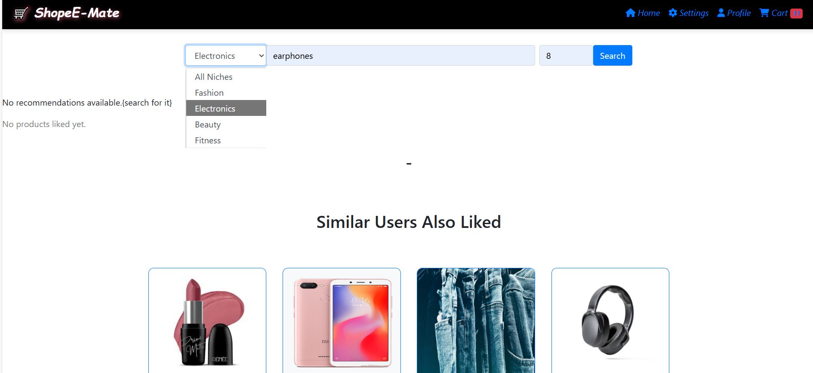
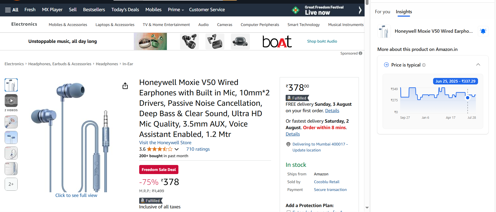
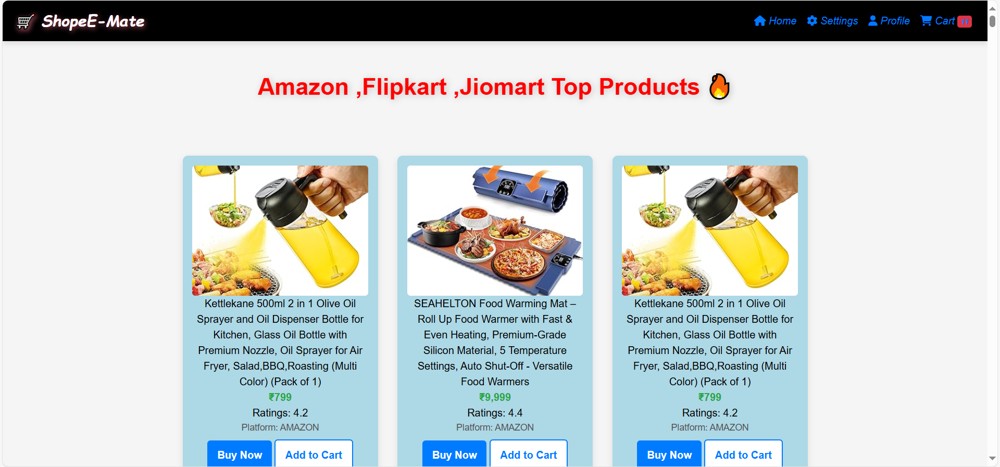
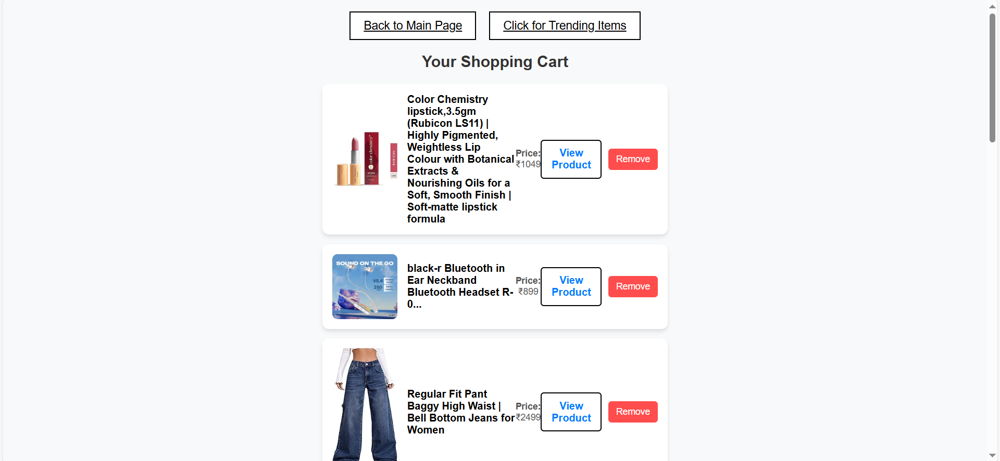

# ShopeE-Mate

ShopeE-Mate is a multi-platform, intelligent product suggestion engine that aggregates and analyzes product data from top e-commerce sites like Amazon, Flipkart, and JioMart in order to improve the online shopping experience. By centralizing real-time data, evaluating product attributes like price, discount, rating, and popularity, and employing AI-powered algorithms to generate intelligent suggestions, this initiative aims to make product discovery easier for consumers.

Product name, image URL, platform link, ratings, price, discount, sub-niche, and category are among the structured data that is stored by the system, which employs Python for data scraping and cleaning. A dynamic and intuitive frontend user interface (UI) created using HTML, CSS, and JavaScript is integrated with a Flask-based online application that functions as the backend. Trending product displays, search filters, an "Add to Cart" option, and a special "Users Also Liked" function that uses click activity to recommend related products are all included in the interface.

Additionally, ShopeE-Mate integrates category-wise analysis, flash messaging for user engagement, and real-time product availability visualization. For a consistent user experience across platforms, the project places a strong emphasis on responsive, simple design aesthetics.

By removing the need to go between several e-commerce sites, this solution not only saves customers time but also assists them in making well-informed purchasing selections. ShopeE-Mate serves as an example of how data science, automation, and web development may be used to solve practical issues with effective, AI-powered solutions.

>  
>  
>  
> 
> 
